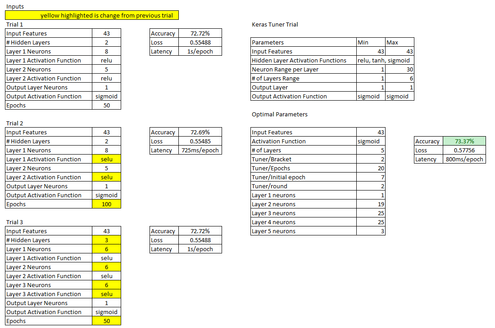

# Analysis of Results

## Overview

The purpose of this analysis is to determine with what degree of accuracy we can predict whether a charity organization will donate or not.

## Results

The best model results obtained were 73.37% accuracy of predicting whether or not a charity organization will donate. 
  
This was obtained using the Sigmoid activation function, and 5 hidden layers of 1 neuron, 19 neurons, 25 neurons, 25 neurons, and 3 neurons, respectively.
  
Below is a table overview of the results for each trial and each configuration of the neural network for that trial.
  

The label 'IS_SUCCESSFUL' is the target for the model.

The features are: 'APPLICATION_TYPE', 'AFFILIATION', 'CLASSIFICATION', 'USE_CASE', 'ORGANIZATION', 'STATUS', 'INCOME_AMT', 'SPECIAL_CONSIDERATIONS', and 'ASK_AMT'.  
  
The columns of 'EIN' and 'NAME' were removed as they are not features, nor are they labels.  
  
For trial 1, the ReLU activation function with 2 layers of 8 and 5 neurons were used initially yielding a 72.72% accuracy.  
  
For trial 2, the ReLU activation function was replaced with the SELU activation function, and the number of epochs was increased from 50 to 100. This yielded an accuracy of 72.69%.  
  
For trial 3, the SELU activation function was used with 3 hidden layers instead of 2, with 6 neurons per layer, and epochs reduced from 100 to 50. The accuracy was 72.72%.  

For the final trial, the Keras Tuner was used to optimize the hyperparameters. The optimal hyperparameters were to use the sigmoid activation function with 5 layers in the configuration of 1/19/25/25/3 configuration. This yielded an accuracy of 73.37%.  
  
## Summary

The best performing model for this study was a Sigmoid activation function with 5 layers of 1/19/25/25/3 neurons configuration yielding an accuracy of 73.37%.  
  
Using a Leaky ReLU or SELU activation function in place of the ReLU function could yield better accuracy results as it avoids the well known problem of dying ReLU. Dying ReLU refers to the issue of some neurons effectively dying during training meaning that they stop outputting anything other than 0. The assumption is that the sigmoid activation function appeared to have superior performance due to the ReLU activation function failing to perform due to dying ReLU. To perform the SELU activation function will require more computational resources.  
  
Also, the dispersion in the 'ASK_AMT' is very large but is still relevant. Another recommendation is to bin the 'ASK_AMT' data into log base 10 bins, e.g. 1,000 to 10,000, 10,000 to 100,000, 100,000 to 1,000,000, etc. By converting this data into bins, it can then be converted using the get_dummies function. This could improve the accuracy of the model prediction.